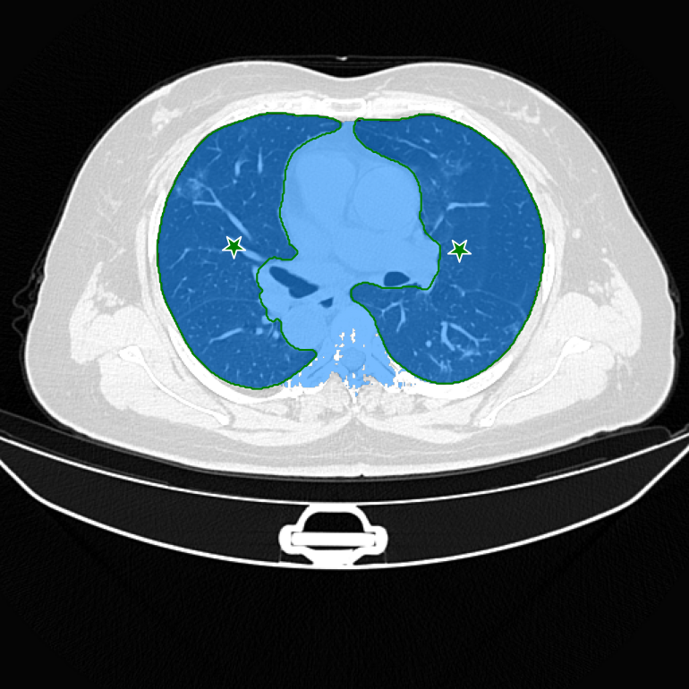
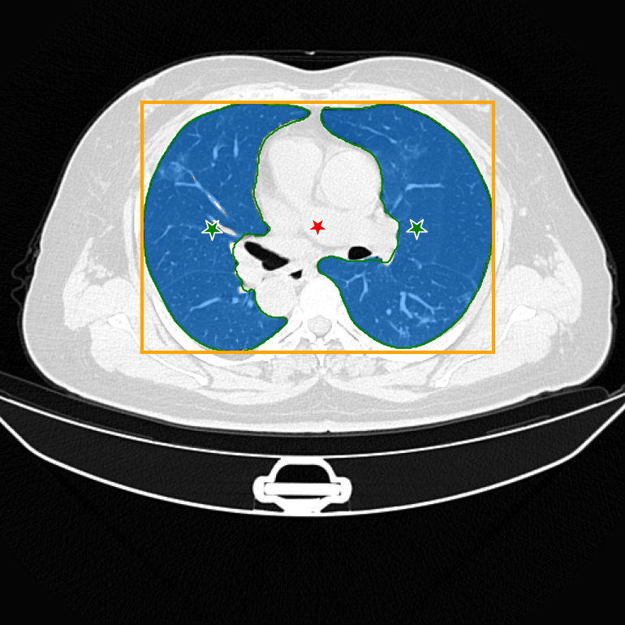

# SAM's Zero-Shot Transfer Capabilities for Medical Image Segmentation

**[i3 lab][i3lab]** by **[QSEG][qseg]**@**[UEx][uex]**

[Juan D. Gutiérrez][jdg], [Roberto Rodriguez-Echeverria][rre], [Emilio Delgado][ed], Miguel Ángel Suero Rodrigo, and [Fernando Sánchez-Figueroa][fsf]

[[`Paper`][paper]][[`Project`][project]][[`Dataset`][dataset]][[`BibTex`][bibtex]]

|  |  |  |  |
|----------------------------------------|----------------------------------------|----------------------------------------|----------------------------------------|

[i3lab]: https://i3lab.unex.es/ "i3 lab"
[qseg]: https://quercusseg.unex.es/ "Quercus Software Engineering Group"
[uex]: https://www.unex.es/ "Universidad de Extremadura"

[jdg]: https://i3lab.unex.es/author/juan-d.-gutierrez/ "Juan D. Gutiérrez"
[rre]: https://i3lab.unex.es/author/roberto-rodriguez-echeverria/ "Roberto Rodriguez-Echeverria"
[ed]: https://i3lab.unex.es/author/emilio-delgado/ "Emilio Delgado"
[fsf]: https://i3lab.unex.es/author/fernando-sanchez-figueroa/ "Fernando Sánchez-Figueroa"

[paper]: https://i3lab.unex.es/ ""
[project]: https://i3lab.unex.es/project/sam-letter/ "SAM's IEEE Signal Processing Letters"
[dataset]: #dataset "Dataset"
[bibtex]: #citing-this-work "Citing This Work"

## Table of Contents

1. [Introduction](#introduction)
2. [Requirements](#requirements)
   1. [Commands](#commands)
3. [Workspace Configuration](#workspace-configuration)
4. [Dataset](#dataset)
5. [Working Data](#working-data)
6. [Image Processing](#image-processing)
7. [Citing This Work](#citing-this-work)

## Introduction

Semantic segmentation of medical images presents an enormous potential for diagnosis and surgery.
However, achieving precise results involves designing and training complex Deep Learning (DL) models specifically for this task.

This paper evaluates [Segment Anything Model (SAM)][sam], a model developed by [Meta][meta] capable of segmenting objects present in virtually any type of image, to segment medical images (specifically, lung computerized tomographies (CTs)).

Although the dataset used to train SAM does not contain a single lung CT, processing a popular dataset comprised of 20 volumes with a total of 3520 slices using the ViT L version of the model yields an average Jaccard index of 91.45% and an average Dice score of 94.95%, above the 70% mark recommended in the literature, and close to state-of-the art models developed specifically for medical segmentation.

These results are achieved without user interaction by providing the model with positive prompts based on the masks of the dataset used and a negative prompt located in the center of bounding box that contains the masks.

The code provided in this repository provides all the tools needed to replicate the experiments described in the paper.

[sam]: https://segment-anything.com/ "Segment Anything Model (SAM): a new AI model from Meta AI that can \"cut out\" any object, in any image, with a single click"
[meta]: https://ai.facebook.com/

## Requirements

Although this project has been developed with PyCharm on Windows, taking advantage of the WSL, it should be portable to Linux and macOS. Below you can find the steps to configure a Windows environment. Change what you need for your platform.

### Commands

- `miniconda` to manage Python virtual environments.
- `wget` to download files.
- `unzip` to unpack compressed files.

## Workspace Configuration

1. Install miniconda:

    ```shell
    $ curl https://repo.anaconda.com/miniconda/Miniconda3-latest-Linux-x86_64.sh -o Miniconda3-latest-Linux-x86_64.sh
    $ bash Miniconda3-latest-Linux-x86_64.sh
    ```

2. Create a new environment:

    ```shell
    $ conda create --name sam python=3.9
    ```

    In this command, **sam** stands for **Segment Anything Model**.

3. Deactivate any previous environment and activate the new one:

    ```shell
    $ conda deactivate
    $ conda activate sam
    ```

4. Install PyTorch, Torchvision, and Torchaudio:

    ```shell
    $ pip install torch torchvision torchaudio --index-url https://download.pytorch.org/whl/cu118
    ```

5. Install SAM:

    ```shell
    $ pip install git+https://github.com/facebookresearch/segment-anything.git
    ```

6. Install this project's requirements:

    ```shell
    $ pip install -r requirements.txt
    ```

7. Execute the shell script **scripts/download_model_checkpoints.sh** to get SAM's model checkpoints:

    ```shell
    $ scripts/download_checkpoints.sh
    ```

8. Configure PyCharm. If you are working on Windows, make sure you use WSL and that your interpreter is also based on WSL.

    > **Note:** Be careful with the EOL configuration in you IDE. Always choose LF instead of CRLF to avoid compatibility issues, as this is a multiplatform project.

> **Note:** If you no longer need the Conda environment, just deactivate it with `conda deactivate` and delete it with `conda remove -n sam --all`.

## Dataset

- **Location:** [Zenodo][dataset_location].
- **Description:** 3520 slices from 20 patients.

Execute the script **scripts/download_dataset.sh** from the root folder of this project to download the dataset:

```shell
$ scripts/download_dataset.sh
```

[dataset_location]: https://zenodo.org/record/3757476 "COVID-19 CT Lung and Infection Segmentation Dataset"

## Working Data

> **Important:** The whole project uses the coordinates convention rows, columns (y, x) instead of x, y. To avoid any misunderstandings, the naming reflects this fact.

The project includes various run/debug configurations. In order to create the working data from the dataset, you need to execute **nifti_to_numpy** with the required arguments. As a reference, this is the command you have to execute from the command line to create the NumPy files from the NIfTI ones, for one image:

```shell
$ conda run -n sam --no-capture-output python nifti_to_numpy.py --input_file_path datasets/zenodo/COVID-19-CT-Seg_20cases/coronacases_001.nii.gz --output_file_path working_data/image_coronacases_001.npy

$ conda run -n sam --no-capture-output python nifti_to_numpy.py --input_file_path datasets/zenodo/Lung_Mask/coronacases_001.nii.gz --output_file_path working_data/masks_coronacases_001.npy
```

You can also run the script **nifti_to_numpy.sh** from the root of this project to create the NumPy files from all the NIfTI ones:

```shell
$ scripts/nifti_to_numpy.sh
```

## Image Processing

You can process just a slide from a CT image:

```shell
$ conda run -n sam --no-capture-output python process_image.py --image_file_path working_data/image_coronacases_001.npy --masks_file_path working_data/masks_coronacases_001.npy --slice 122 --debug 
```

You can also process the whole CT image:

```shell
$ conda run -n sam --no-capture-output python process_image.py --image_file_path working_data/image_coronacases_001.npy --masks_file_path working_data/masks_coronacases_001.npy --debug 
```

You can even process a list of images using the script **process_images.sh**. Use the list inside it to select the images to process. When it finishes, the results will be stored inside the folder **results** in the **working_data** folder, in a series of folders named after each image processed. A summary of the results will be stored in the folder **results**.

## Citing This Work

If you use this work in your research, please cite us with the following BibTeX entry:

```
@article{citation-key,
  title        = {Paper Title},
  author       = {Guti\'{e}rrez, Juan D. and Rodriguez-Echeverria, Roberto and Delgado, Emilio and Suero Rodrigo, Miguel \'{A}ngel and S\'{a}nchez-Figueroa, Fernando},
  year         = 2023,
  journal      = {journal-id}
}
```
